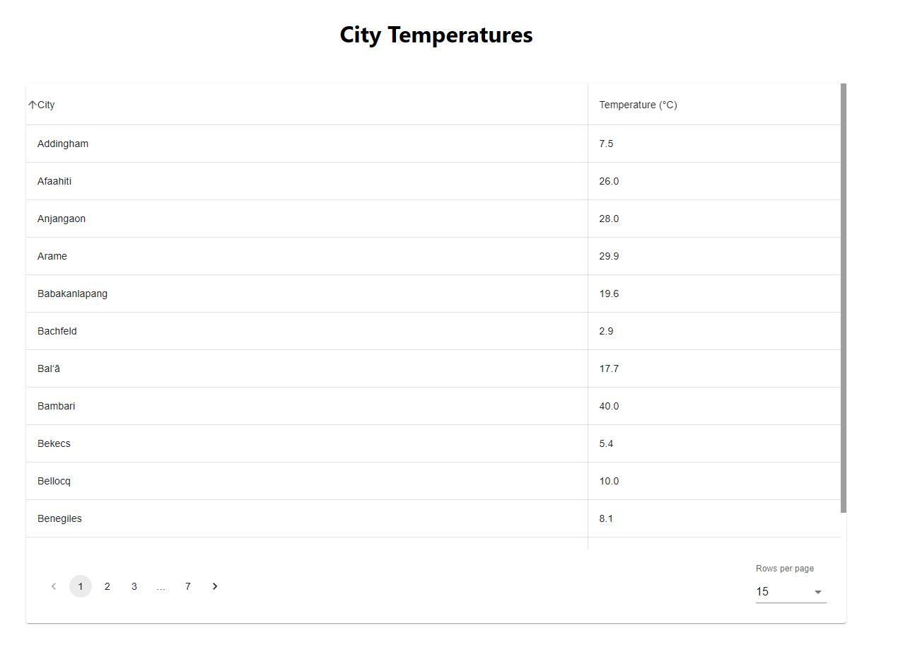

# Weather API with frontend and backend with postgres able to be deployed with docker

run command: docker compose -f docker-compose.yml up --build
backend: .\gradlew bootRun
frontend: npm start

When application starts, script loads 100 random city names to database and queries current temperature for all 100 cities

After every restart, script should delete all temperature data and load new data

Weather is asked through this API - https://openweathermap.org/current#cityid

Frontend has a one pager where you can see table of cities and current temperatures

Table headers are sortable

Table has pagination so that user can choose either 15 or 25 results per page

backend has cache for weather data

automated scheduled task / cron job to update weather data daily with retry mechanics

Dockerfile to run the application as Docker container